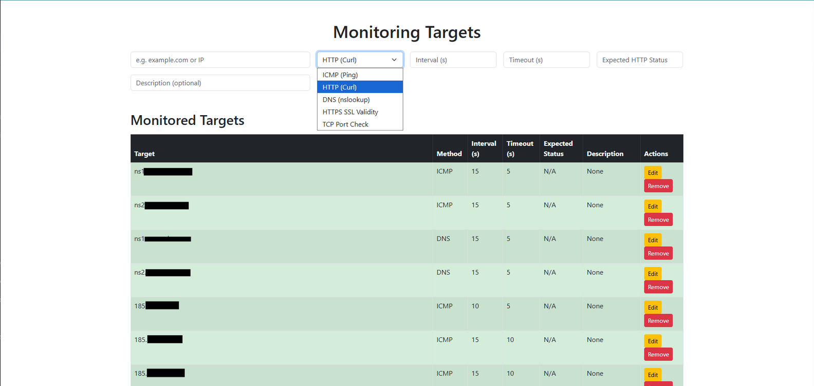

# Monitoring Service


A lightweight, open-source monitoring service that tracks the health of your HTTP endpoints, DNS records, and ICMP pings. This service is perfect for small-scale monitoring needs, with Prometheus integration for detailed metrics.

---

## Features
- **HTTP Monitoring**: Track response time, status codes, and content length for HTTP endpoints.
- **ICMP Ping Monitoring**: Monitor latency and packet loss for any IP or domain.
- **DNS Monitoring**: Measure DNS resolution times for any domain.
- **Prometheus Integration**: Expose metrics for integration with Prometheus and Grafana.
- **Web Interface**: Add, monitor, and remove targets easily via a user-friendly web UI.
- **Periodic Scheduling**: Powered by APScheduler to run tasks at defined intervals.

---

## Screenshots
### Orca Monitoring UI



---

## Installation

### Prerequisites
- Python 3.9 or higher
- pip (Python package installer)

### Steps
1. **Clone the Repository**:
   ```bash
   git clone https://github.com/imanbakhtiari/orca.git
   cd orca


```
pip install requirement.txt
```


```
python3 app.py
```

- make it systemd by this 
```bash
[Unit]
Description=Flask Application for Orca
After=network.target

[Service]
User=root
WorkingDirectory=/opt/orca
ExecStart=/usr/bin/python3 app.py
Environment="FLASK_APP=app.py"
Environment="FLASK_ENV=production"
Environment="PYTHONUNBUFFERED=1"
ExecStartPre=/bin/mkdir -p /opt/orca/instance
ExecStartPre=/bin/chown root:root /opt/orca/instance
Restart=always

[Install]
WantedBy=multi-user.target
```


---

## Contributing

We welcome contributions from the community! Whether it's bug fixes, new features, or improvements to the documentation, all contributions are appreciated.

---

